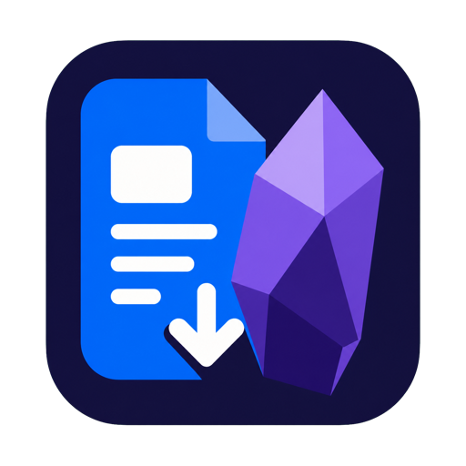
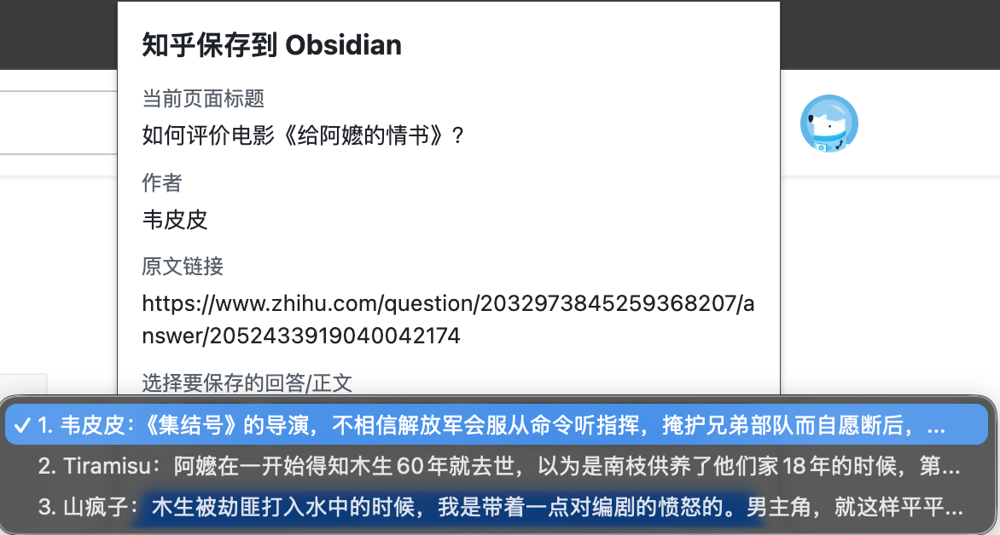
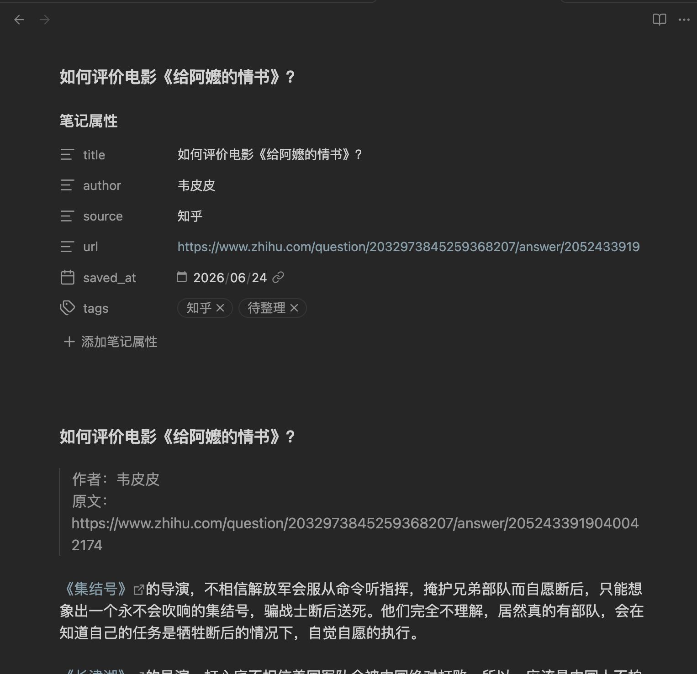

# 中文网页保存到 Obsidian

<p align="center">
  
</p>

<p align="center">
  <a href="README_EN.md">English</a> ·
  <a href="CHANGELOG.md">更新记录</a> ·
  <a href="PRIVACY.md">隐私政策</a> ·
  <a href="SECURITY.md">安全说明</a>
</p>

[](https://github.com/wanghaha1997/chinese-web-to-obsidian/actions/workflows/test.yml)
[](https://github.com/wanghaha1997/chinese-web-to-obsidian/releases)
[](LICENSE)
[](extension/manifest.json)
[](#隐私说明)

一个本地优先的 Chrome 扩展，把知乎、财新和知识星球中当前已经显示的内容保存为结构清晰、可关联作者的 Obsidian Markdown 笔记。

这个项目由一个 Chrome 扩展和一个本地 Node.js 服务组成，可以把当前浏览器里已经打开并渲染完成的知乎文章、回答、专栏页面，财新文章页面，以及知识星球内容保存为 Markdown 文件，并写入本地 Obsidian Vault。

> English: Save rendered Chinese web articles and answers to a local Obsidian vault as Markdown.



## 为什么使用它

- **选对内容再保存**：知乎问题页和知识星球列表页可选择单条内容，也可一次保存当前页面的全部候选内容。
- **适合 Obsidian 整理**：保留标题、作者、来源和原文链接，作者会写成 `[[内部链接]]`，便于关联同一作者的其他笔记。
- **不同来源自动归档**：知乎、财新、知识星球可以分别设置默认文件夹。
- **内容留在本机**：扩展只把当前页面已显示的内容发送到 `127.0.0.1` 本地服务，不依赖云端剪藏服务。

## 支持范围

| 网站 | 当前支持 | 说明 |
| --- | --- | --- |
| 知乎 | 问题回答、专栏文章 | 支持选择单个回答或全部保存 |
| 财新 | 当前已打开并显示的文章 | 不绕过订阅或权限限制 |
| 知识星球 | 当前可见主题、已显示评论 | 默认不保存评论，可在弹窗中选择 |

网站页面结构可能调整。如果提取失效，请提交 [Bug 报告](https://github.com/wanghaha1997/chinese-web-to-obsidian/issues/new?template=bug_report.yml)，并提供脱敏后的页面类型和复现步骤，不要上传 Cookie、Token、付费正文或个人隐私信息。

## 三步开始

```bash
git clone https://github.com/wanghaha1997/chinese-web-to-obsidian.git
cd chinese-web-to-obsidian
npm install
cp config.example.json config.json
```

1. 修改 `config.json` 中的 `vaultPath`，然后运行 `npm start`。
2. 打开 `chrome://extensions/`，开启开发者模式，加载项目中的 `extension` 文件夹。
3. 打开受支持的网页，点击扩展图标，再点击“保存到 Obsidian”。

第一次使用建议继续阅读下面的[保存路径配置](#修改保存路径)和[完整扩展加载步骤](#加载-chrome-扩展)。

## 特点

- 本地运行，不依赖云端服务
- 不读取知乎 Cookie
- 不模拟登录知乎
- 不调用知乎、财新或知识星球内部接口
- 不上传文章内容、密码、Token 或 API Key
- 支持知乎问题回答页和知乎专栏文章页
- 试验支持财新文章页
- 试验支持知识星球当前可见内容和页面已显示评论
- 问题页和知识星球列表页支持选择单条内容，也支持全部保存
- 可以在扩展弹窗里修改 Obsidian 保存目录，macOS 支持按钮选择 Vault 文件夹
- 支持知乎、财新、知识星球分别保存到不同文件夹
- 自动转换为 Obsidian 友好的 Markdown
- 文件重名时自动保留已有文件，生成新文件名

## 适合谁使用

这个项目适合希望把中文网页内容整理到 Obsidian 的用户，尤其适合：

- 想把知乎文章、知乎回答、财新文章或知识星球内容保存成 Markdown
- 想保留标题、作者、原文链接和正文
- 不想把内容发送到第三方服务
- 能接受在本机运行一个轻量 Node.js 服务

## 工作方式

```text
Chrome 当前支持的网站页面
  -> Chrome 扩展读取已渲染的标题、作者、正文、链接
  -> POST http://127.0.0.1:3721/save
  -> 本地 Node.js 服务把 HTML 转成 Markdown
  -> 保存到 Obsidian Vault
```

服务只监听 `127.0.0.1`，也就是只允许本机访问。

## 项目结构

```text
chinese-web-to-obsidian/
  config.json              # 本地保存配置
  config.example.json      # 配置示例
  package.json             # Node.js 依赖和启动命令
  server/
    index.js               # 本地 Express 服务
  scripts/
    install-launch-agent.sh
    uninstall-launch-agent.sh
  extension/
    manifest.json          # Chrome Extension Manifest V3
    content.js             # 读取支持网站页面内容
    popup.html             # 扩展弹窗页面
    popup.js               # 弹窗交互和保存请求
  tests/
    content-extraction.test.mjs
    config-validation.test.mjs
    markdown-output.test.mjs
```

项目维护计划见 [ROADMAP.md](ROADMAP.md)，参与开发前请阅读 [CONTRIBUTING.md](CONTRIBUTING.md)。项目如何使用 Codex 进行开源维护，见 [Maintaining with Codex](docs/MAINTAINING_WITH_CODEX.md)。

## 安装 Node.js 依赖

克隆项目后，进入项目目录：

```bash
cd chinese-web-to-obsidian
```

安装依赖：

```bash
npm install
```

安装完成后，终端里应该看到类似 `found 0 vulnerabilities` 的提示。

## 修改保存路径

复制配置示例：

```bash
cp config.example.json config.json
```

打开 `config.json`：

```json
{
  "vaultPath": "/Users/你的用户名/Documents/ObsidianVault",
  "saveFolder": "网页收藏",
  "sourceFolders": {
    "zhihu": "知乎",
    "caixin": "财新",
    "zsxq": "知识星球"
  }
}
```

把 `vaultPath` 改成你的 Obsidian Vault 真实路径。`sourceFolders` 是不同来源在 Vault 里面的子文件夹名称，服务会自动创建这些文件夹。`saveFolder` 是兜底目录，用于以后新增但还没有单独配置的来源。

示例：

```json
{
  "vaultPath": "/Users/你的用户名/Documents/我的Obsidian",
  "saveFolder": "网页收藏",
  "sourceFolders": {
    "zhihu": "知乎",
    "caixin": "财新",
    "zsxq": "知识星球"
  }
}
```

注意：

- `vaultPath` 必须是绝对路径。
- `saveFolder` 只能是 Vault 里面的相对目录，不要写成 `/Users/...`。
- `sourceFolders` 里的每个文件夹也只能是 Vault 里面的相对目录。
- 路径和中文内容都会按 UTF-8 保存。

启动本地服务后，也可以在 Chrome 扩展弹窗里展开“保存目录”，直接修改：

- `Vault 路径`：Obsidian Vault 的绝对路径
- `Vault 内文件夹`：兜底子文件夹，例如 `网页收藏`
- `知乎保存文件夹`：知乎内容默认保存的文件夹
- `财新保存文件夹`：财新内容默认保存的文件夹
- `知识星球保存文件夹`：知识星球内容默认保存的文件夹

在 macOS 上，可以点击“选择并保存 Vault 文件夹”打开系统文件夹选择窗口。选中后会直接更新 `config.json`。

点击“保存路径设置”后会更新 `config.json`，不需要重启 Node.js 服务。

## 启动本地服务

在项目目录运行：

```bash
npm start
```

看到下面这行，表示服务已经启动：

```text
保存到 Obsidian 服务已启动：http://127.0.0.1:3721
```

可以用下面命令检查服务是否正常：

```bash
curl http://127.0.0.1:3721/health
```

如果返回 `{"ok":true}`，说明服务正常。

## 设置开机自动启动

macOS 可以把本地 Node.js 服务安装成当前用户的 LaunchAgent。安装后，每次登录电脑都会自动启动服务。

在项目目录运行：

```bash
chmod +x scripts/install-launch-agent.sh scripts/uninstall-launch-agent.sh
./scripts/install-launch-agent.sh
```

安装成功后，可以检查服务是否正常：

```bash
curl http://127.0.0.1:3721/health
```

如果返回 `{"ok":true}`，说明后台服务已经启动。

后台服务日志在：

```text
logs/server.out.log
logs/server.err.log
```

如果以后不想开机自动启动，可以运行：

```bash
./scripts/uninstall-launch-agent.sh
```

## 加载 Chrome 扩展

1. 打开 Chrome，在地址栏输入 `chrome://extensions/`。
2. 打开右上角的“开发者模式”。
3. 点击“加载已解压的扩展程序”。
4. 选择项目里的 `extension` 文件夹。

本机路径示例：

```text
你的项目目录/chinese-web-to-obsidian/extension
```

加载成功后，Chrome 工具栏会出现“中文网页保存到 Obsidian”。如果没看到，可以点击工具栏右侧的拼图图标，把扩展固定出来。

## 使用方法

1. 确认 Node.js 服务仍在运行。
2. 在 Chrome 打开一个知乎问题回答页、知乎专栏文章页、财新文章页，或者知识星球内容页。
3. 等页面正文加载完成。
4. 点击 Chrome 工具栏里的扩展图标。
5. 弹窗里会显示标题、作者、原文链接。
6. 如果当前页面读取到多段内容，可以在“选择要保存的回答/正文”下拉框里选择单条，也可以选择“全部保存”。
7. 如需修改保存位置，展开“保存目录”，可以手动填写路径后点击“保存路径设置”，也可以点击“选择并保存 Vault 文件夹”。
8. 确认弹窗显示的保存目录正确。
9. 点击“保存到 Obsidian”。
10. 成功后，弹窗会显示保存路径。

保存后的 Markdown 文件位置会按来源区分，类似：

```text
/Users/你的用户名/Documents/ObsidianVault/知乎/文章标题.md
/Users/你的用户名/Documents/ObsidianVault/财新/文章标题.md
/Users/你的用户名/Documents/ObsidianVault/知识星球/文章标题.md
```

如果同名文件已经存在，服务会自动保存成：

```text
文章标题-1.md
文章标题-2.md
```

## 生成的 Markdown 格式

作者会保存为 Obsidian 内部链接，方便把同一作者的其他笔记关联起来。
`source` 和标签会根据来源写成 `知乎`、`财新` 或 `知识星球`。

```md
---
title: 文章标题
author: "[[作者名称]]"
source: 知乎
url: 原文链接
saved_at: 2026-06-24
tags:
  - 知乎
  - 待整理
---

# 文章标题

> 作者：[[作者名称]]
> 原文：原文链接

正文内容
```

## 隐私说明

本项目只读取当前浏览器中已经显示出来的页面内容，并通过 `http://127.0.0.1:3721` 发送给本机服务保存。

本项目不会：

- 读取知乎 Cookie
- 获取知乎账号密码
- 调用知乎、财新或知识星球内部 API
- 上传文章内容到外部服务器
- 使用任何云端同步或 AI 摘要服务

## 常见错误及排查方式

### 保存失败：请确认 Node.js 服务已经启动

说明扩展无法访问本机服务。请确认终端里已经运行：

```bash
npm start
```

也可以用下面命令检查服务：

```bash
curl http://127.0.0.1:3721/health
```

### 未能读取正文

可能原因：

- 当前页面不是知乎问题回答页、知乎专栏文章页、财新文章页或知识星球内容页。
- 页面正文还没加载完。
- 页面 DOM 结构变化，当前选择器没有匹配到正文。

可以刷新页面，等正文出现后再点击扩展。

### config.json 缺少 vaultPath

请检查 `config.json` 是否存在，并且格式类似：

```json
{
  "vaultPath": "/Users/你的用户名/Documents/ObsidianVault",
  "saveFolder": "网页收藏",
  "sourceFolders": {
    "zhihu": "知乎",
    "caixin": "财新",
    "zsxq": "知识星球"
  }
}
```

JSON 里不能有多余逗号，字符串必须使用英文双引号。

### 保存路径不对

可以在扩展弹窗里展开“保存目录”修改路径，也可以检查 `config.json` 里的 `vaultPath` 是否是你的真实 Obsidian Vault 路径。服务会把文件保存到：

```text
vaultPath/sourceFolders.zhihu/文章标题.md
vaultPath/sourceFolders.caixin/文章标题.md
vaultPath/sourceFolders.zsxq/文章标题.md
```

如果在弹窗里更新失败，先确认 `npm start` 的服务仍在运行，并确认 `Vault 路径` 是绝对路径。

如果点击“选择并保存 Vault 文件夹”失败：

- 先确认本地服务正在运行。
- 当前按钮选择功能仅支持 macOS。
- 如果系统弹窗被取消，重新点击按钮即可。

## 查看 Node.js 服务日志

如果是手动运行 `npm start`，启动服务的那个终端窗口就是日志窗口。

如果已经安装开机自启动，日志在：

```text
logs/server.out.log
logs/server.err.log
```

保存成功时会显示：

```text
已保存：/Users/你的用户名/Documents/ObsidianVault/网页收藏/文章标题.md
```

保存失败时也会在这里显示错误原因，例如配置错误、正文为空、JSON 格式错误等。

## 开发自检

检查 content script 对知乎专栏、知乎回答、财新文章和知识星球内容 DOM 的提取逻辑：

```bash
npm test
```

手动测试本地保存接口：

```bash
curl http://127.0.0.1:3721/config
```

```bash
curl -X POST http://127.0.0.1:3721/save \
  -H 'Content-Type: application/json' \
  --data-binary '{
    "source": "zhihu",
    "title": "测试文章",
    "author": "测试作者",
    "url": "https://zhuanlan.zhihu.com/p/test",
    "html": "<p>这是一段测试正文。</p>",
    "savedAt": "2026-06-24T12:00:00.000Z"
  }'
```

## 截图

### 扩展弹窗


### Obsidian 保存结果



## 维护者发布检查

如果你要修改代码并发布新版本，建议发布前确认：

- 不提交个人本地的 `config.json`
- 不提交知乎 Cookie、密码、Token 或 API Key
- `npm install` 能成功安装依赖
- `npm test` 能通过
- `npm start` 能启动服务
- Chrome 可以加载 `extension` 文件夹
- 知乎专栏文章可以保存成功
- 知乎问题回答可以保存成功
- 财新文章可以保存成功
- 知识星球当前可见内容可以保存成功
- README 截图和说明仍然准确

## 免责声明

本项目是个人开源工具，不隶属于知乎、财新、知识星球或 Obsidian，也不是这些产品的官方工具。请只保存你有权保存和整理的内容，并遵守相关网站条款和版权要求。本项目不会绕过登录、订阅、付费或权限限制，只读取当前浏览器已经显示出来的内容。

## License

[MIT](LICENSE)
